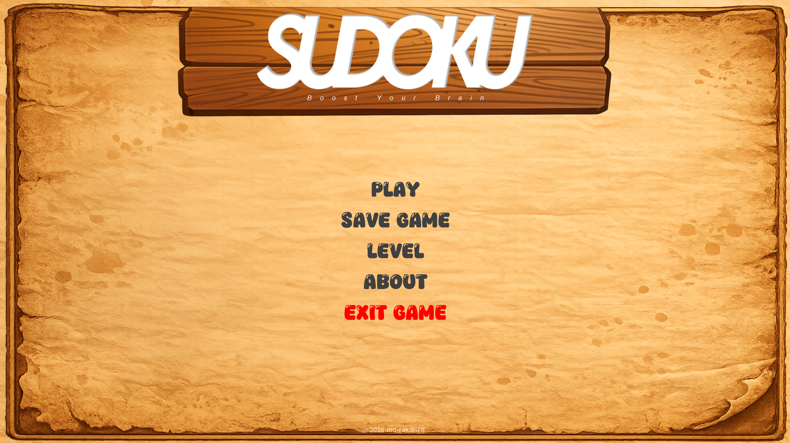
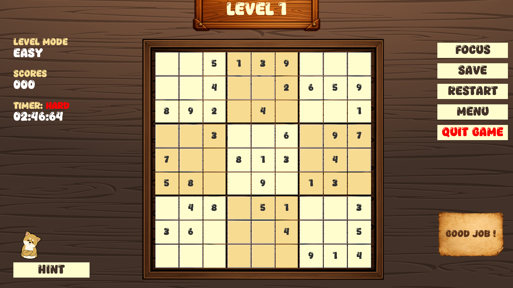
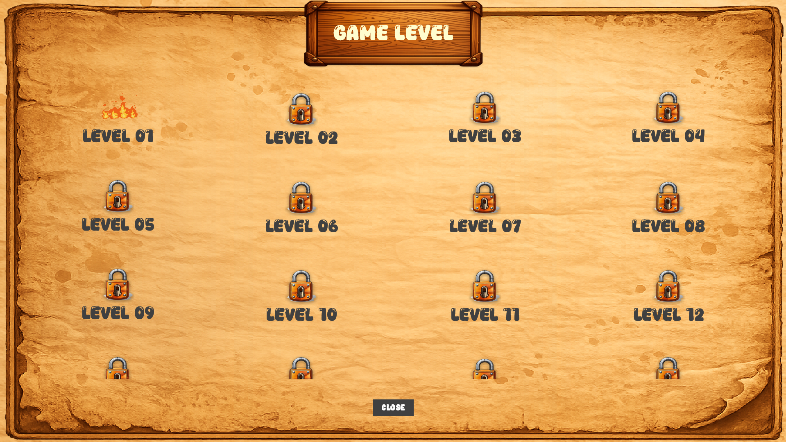
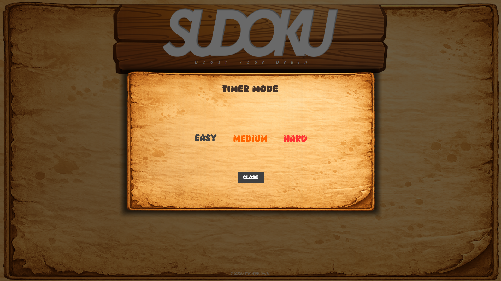

# sudoku-game
A modern and interactive Sudoku Game built using Java, focusing on clean UI design, smooth user experience, and efficient problem-solving using algorithms.

## Overview
This project is a classic 9×9 Sudoku game where players fill the grid while following Sudoku rules. It demonstrates strong concepts of Object-Oriented Programming (OOP), algorithm design, and UI/UX implementation.

## Features
1. Play standard Sudoku (9×9 grid)
2. Real-time input validation
3. Hint system
4. Reset and New Game options
5. Game timer
6. Multiple difficulty levels
7. Interactive and user-friendly interface

## User Interface
1. Game Splash screen   
2. Game Menu 
3. Game Board 
4. Game Levels 
5. Game Timer Mode 

## Installation & Setup
1. Clone the repository: git clone https://github.com/md-rakib-78/sudoku-game.git
2. Open in preferred IDE (VS Code)
3. Run the project: start.java

## Future Improvements
1. Android version
2. Online multiplayer
3. Leaderboard system
4. Sound effects and animations

## Author
Md Rakibul Islam  
CSE Student | Java Developer

## ⭐ Support
If you like this project, please give it a ⭐ on GitHub!
